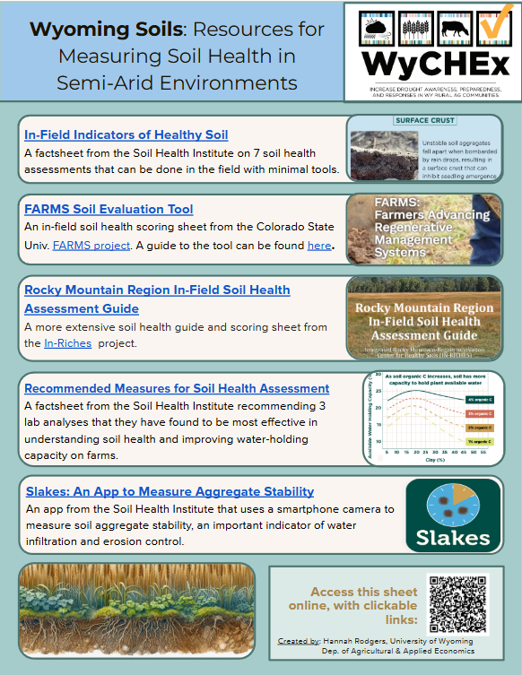
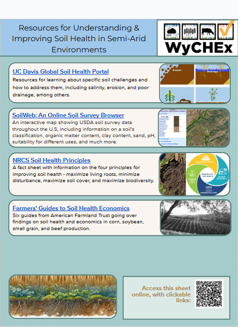
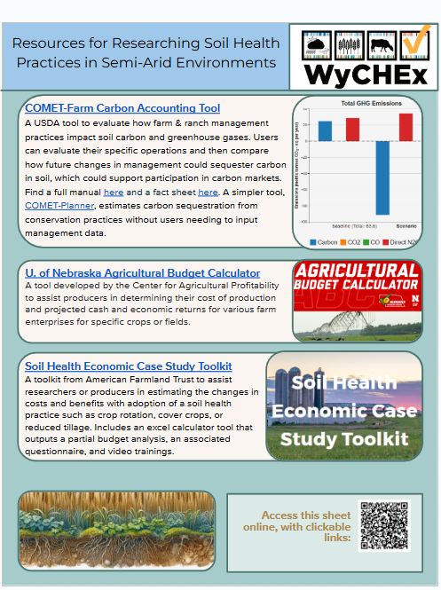

This guide to soil health resources is meant to help producers in semi-arid environments measure, understand, and improve soil health on their operations. While most soil health resources are tailored to more humid environments, this guide focuses on tools and resources tailored to drier regions like the High Plains. 

 The list includes resources such as:
 
 *[The FARMS Soil Evaluation Tool](https://farmsproject.org/wp-content/uploads/2023/10/SET_Y3.pdf). This in-field soil health scoring sheet from Colorado State University guides producers through evaluating soil health indicators directly in the field.
 
 *[SoilWeb](https://casoilresource.lawr.ucdavis.edu/gmap/). This interactive map provides USDA soil survey data throughout the U.S, including information on a soil’s classification, organic matter content, pH, suitability for different uses, and much more.
 
*[The COMET-Farm Carbon Accounting Tool](https://comet-farm.com/home). This USDA tool evaluates how farm & ranch management practices impact soil carbon and greenhouse gases for a specific operation. Users can also compare how changes in management could sequester carbon in the soil, which can support participation in carbon markets.

This guide will be used by extension and other agricultural service providers who work on soil health improvement in Wyoming and neighboring states, and can be accessed [here](https://docs.google.com/presentation/d/1uIMj1XKqpeCO-S18pmUr4XG89B51nOLToo1nEQ7BrDQ/edit?usp=sharing).

