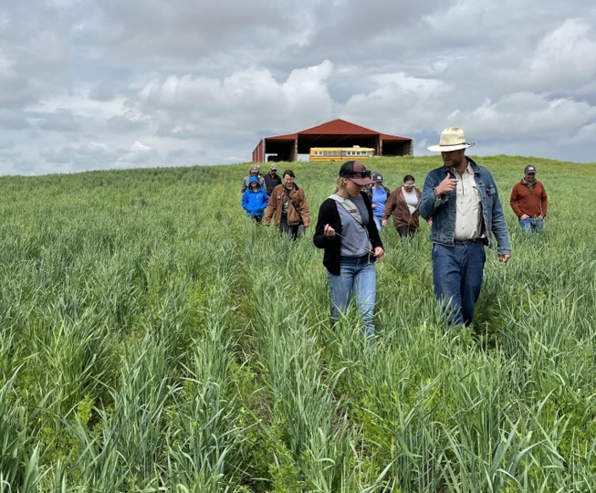
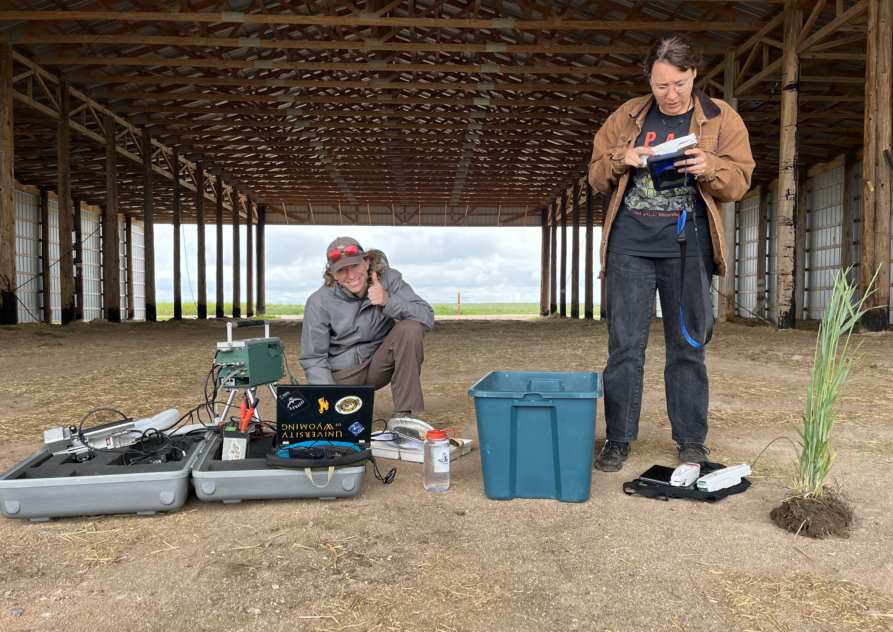

<!--CSS styling-->

### 

<!--1: Kernza Field Day for Western SARE Grant-->

#### Kernza Field Day for Western SARE Grant

Hosted a 

<!--1: Nepal Orchard Grant-->

#### Nepal Orchard Soil Workshop

This project was a collaboration between Biloba Organic (a research farm halfway between Kathmandu, Nepal and Tibet), the nearby Shree ___ Secondary School, and the University of Wyoming Center for Global Studies. We coordinated between these partners to establish a teaching orchard at the school that could help Nepali families gain the resources and knowledge to grow higher-value crops. I travelled to Nepal winter 2023 to help initiate the project and lead a soil health workshop for the students. The project now has 25 apple, peach, coffee, and orange trees managed by a local school???s ???Eco-Club,??? and plans to expand to a second school.

<!--1: Kernza in Context-->

#### Kernza in Context Educational Modules