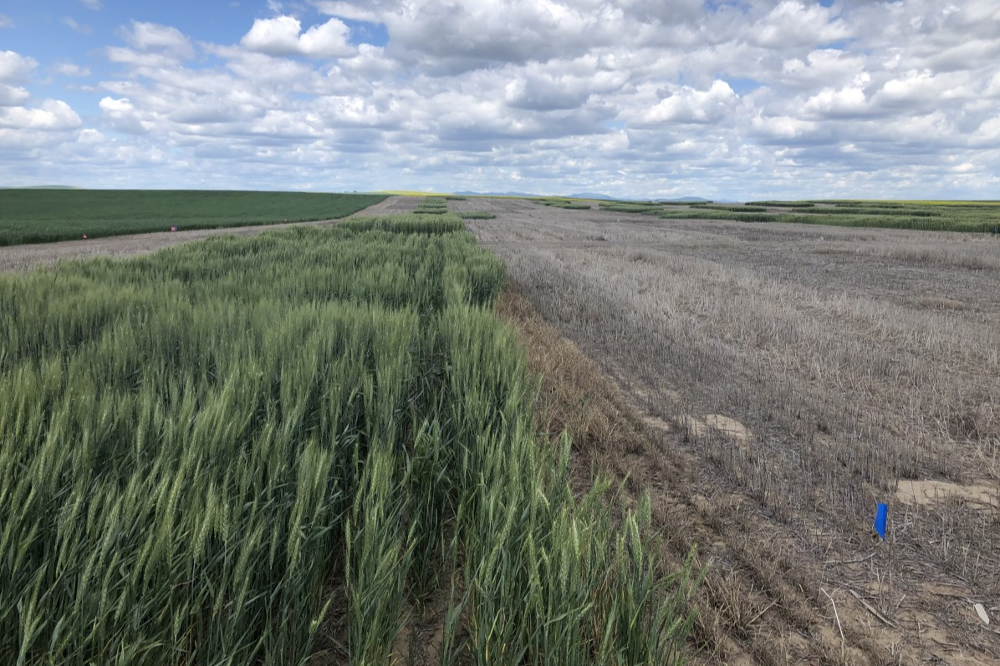
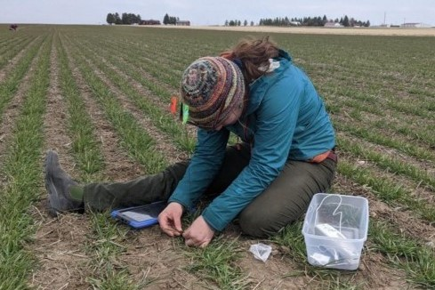
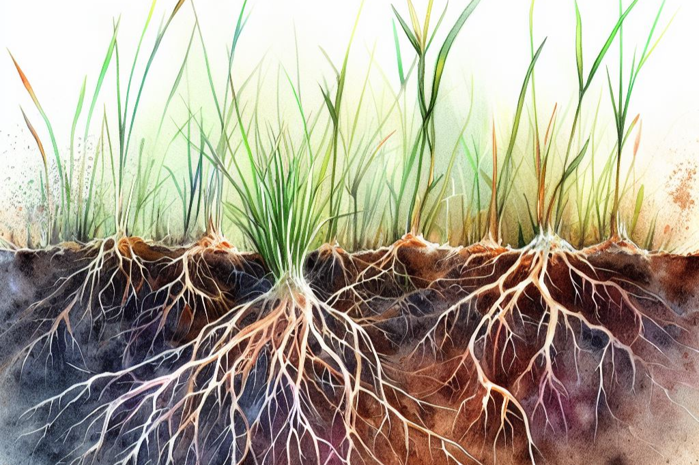
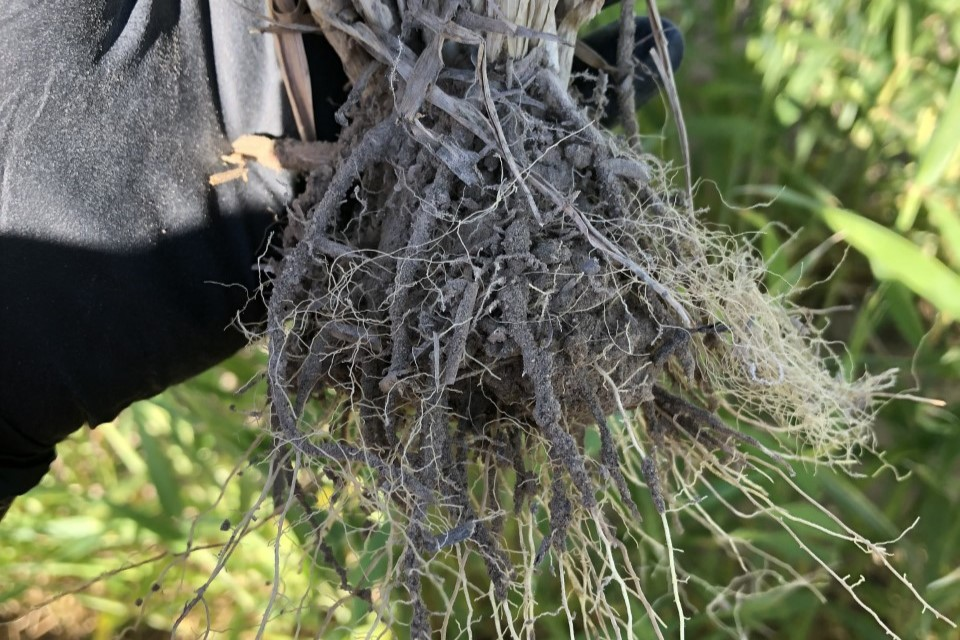
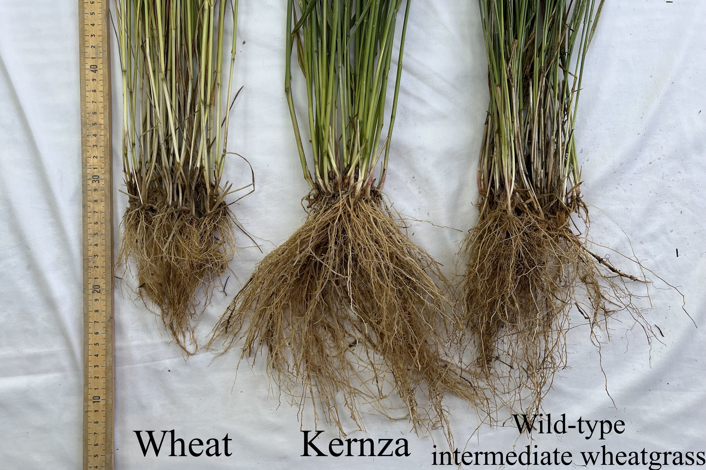

<!--CSS styling-->

### 

<!--PAPER 1: OREI-->

 

#### 1. Compost & Soil Health
**Rodgers** HR, Norton JB, Norton U, & van Diepen LTA. 2024. **Sustaining vulnerable agroecosystems with compost: Lasting benefits to soil health and carbon storage in semiarid winter wheat.** *Applied Soil Ecology* 204, 105716. https://doi.org/10.1016/j.apsoil.2024.105716

 

 

<!--PAPER 2: Dissertation-->

 

#### 2. Dissertation
**Rodgers** HR. 2024. **Sustaining vulnerable agroecosystems: Management impacts on soil health and microbiology in Wyoming High Plains wheat and Kernza agriculture.** *Ph.D. Dissertation, University of Wyoming*.

 

 

<!--PAPER 3: Review-->

 

#### 3. Wheat & Soil Microorganisms
**Rodgers** HR, Norton JB, & van Diepen LTA. 2021. **Effects of semiarid wheat agriculture management practices on soil microbial properties: A review.** *Agronomy* 11(5). https://doi.org/10.3390/agronomy11050852

 

 

### In-Progress

<!--PAPER 4: Rhizosphere-->

 

#### 4. Kernza Rhizosphere
**Rodgers** HR, Norton, JB, Norton, U., & van Diepen, LTA. **Rooting for microbes: Impacts of plant breeding on the Kernza rhizosphere.**
  

 

 

<!--PAPER 5: Kernza Wyoming-->

 

#### 5. Kernza in Wyoming
**Rodgers** HR, Norton, JB, Norton, U, & van Diepen, LTA. **Kernza in Wyoming: Perennial grains for vulnerable lands.**

 

 

<!--PAPER 6: Bulletin-->

 

#### 6. Annual & Perennial Grain Budgets
**Rodgers** HR, Fancher H, Foulke T, & Peters T. **Perennial grain & wheat-fallow budgets: Comparing an annual & perennial cropping system in southeastern Wyoming.**

 

 

