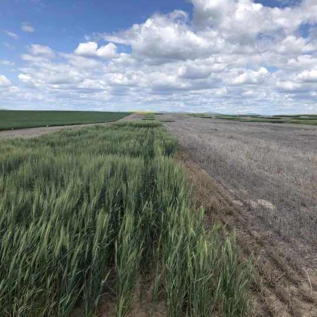
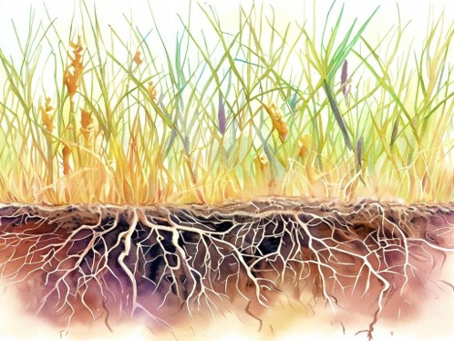
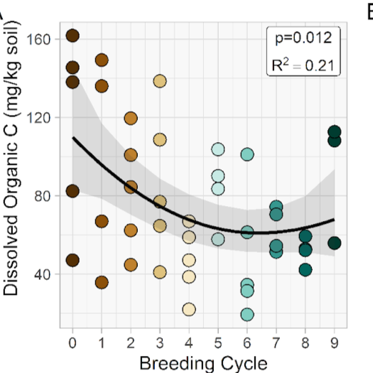
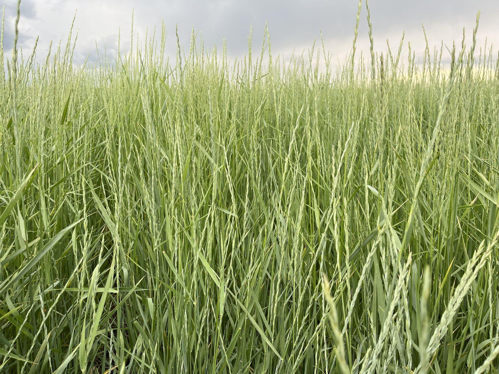

#### Find full copies on [google scholar](https://scholar.google.com/citations?user=https://scholar.google.com/citations?user=rK1CuzcAAAAJ&hl=en&user=rK1CuzcAAAAJ)

1. **Rodgers** HR, Norton JB, Norton U, & van Diepen LTA. 2024. Sustaining vulnerable agroecosystems with compost: Lasting benefits to soil health and carbon storage in semiarid winter wheat *Triticum aestivum, L.*. *Applied Soil Ecology* 204, 105716. https://doi.org/10.1016/j.apsoil.2024.105716

2. **Rodgers** HR. 2024. Sustaining vulnerable agroecosystems: Management impacts on soil health and microbiology in Wyoming High Plains wheat and Kernza agriculture. *Ph.D. Dissertation, University of Wyoming*. https://www.proquest.com/docview/3094699934/abstract/FF001223960941A4PQ/1

3. **Rodgers** HR, Norton JB, & van Diepen LTA. 2021. Effects of semiarid wheat agriculture management practices on soil microbial properties: A review. *Agronomy* 11(5). https://doi.org/10.3390/agronomy11050852

#### In-Progress

4. 
  **Rodgers** HR, Norton, JB, Norton, U., & van Diepen, LTA. Rooting for Microbes: Impacts of Plant Breeding on the Kernza Rhizosphere 

5.  **Rodgers** HR, Norton, JB, Norton, U., & van Diepen, LTA. Kernza in Wyoming: Perennial grains for vulnerable lands

6. Extension Bulletin
**Rodgers** HR, Fancher H, Foulke T, & Peters T. Kernza® Perennial Grain and Wheat-Fallow Budgets: Comparing an Annual and Perennial Cropping System in Southeastern Wyoming.
